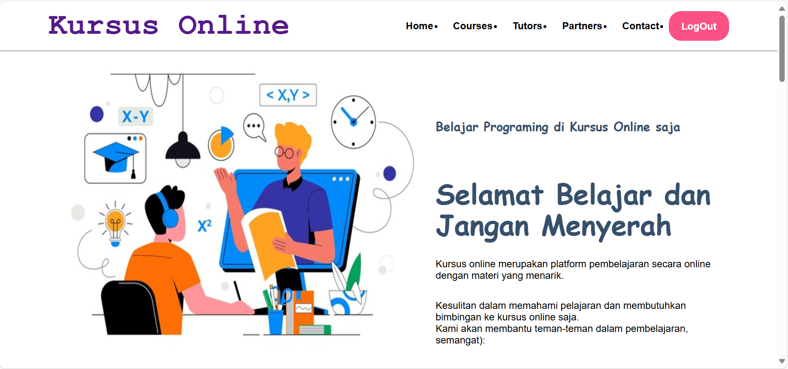
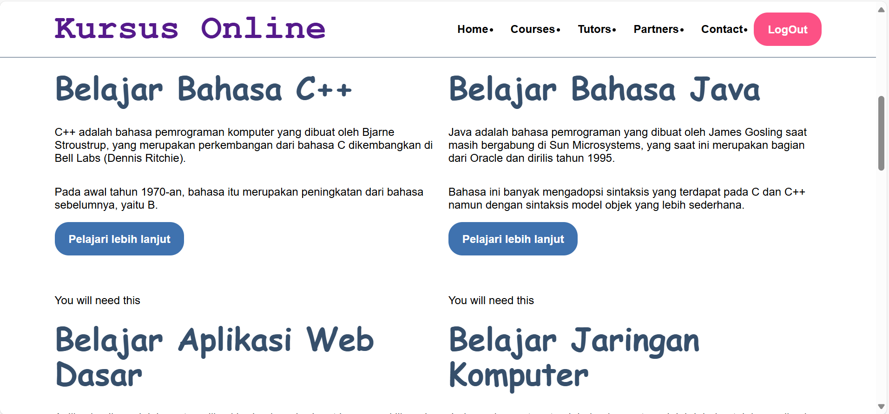
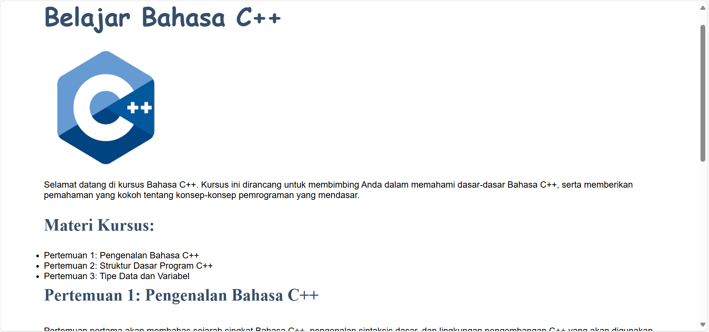
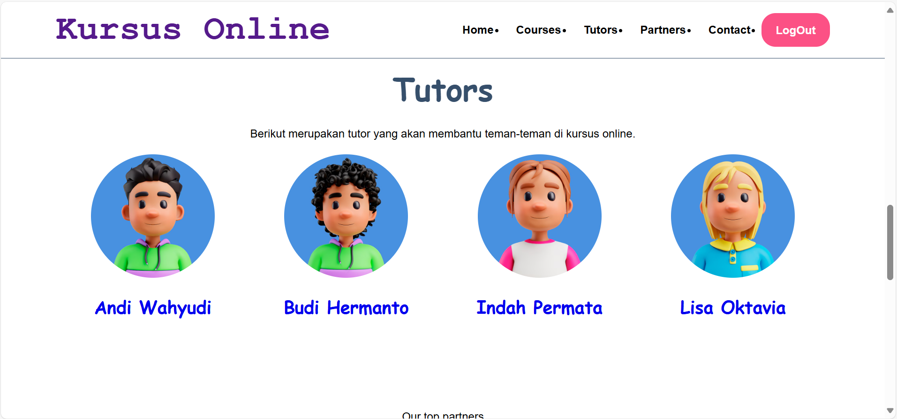
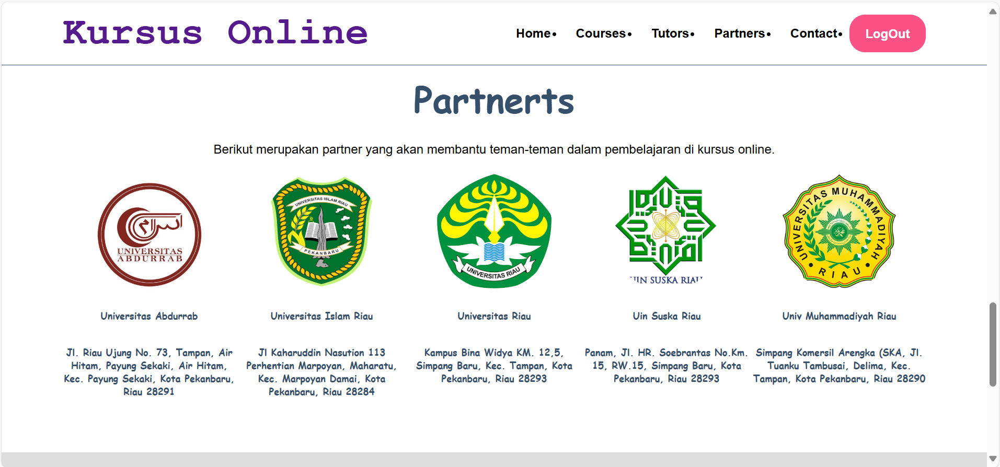
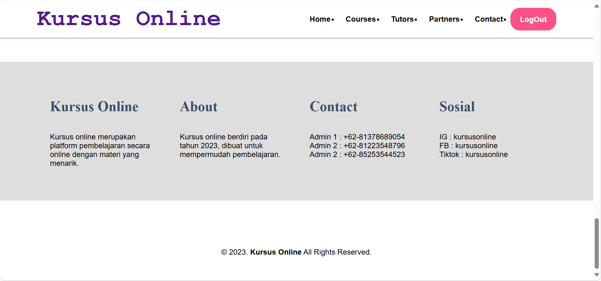

# 📘 Kursus Online Website

Deskripsi singkat tentang aplikasi. Misalnya:

> Aplikasi ini merupakan sistem untuk belajar secara online berbasis web yang memudahkan pengguna untuk belajar dimana dan kapan pun.

---

## 🚀 Fitur Utama

- 🔐 Login & SignUp
- 📋 Dashboard Home
- ✅ Pilih Materi

---

## 📸 Tampilan Setiap Halaman

### 1. Halaman Login


### 2. Halaman SignUp


### 3. Home



### 4. Courses



### 5. Materi Courses



### 6. Tutors



### 7. Partners



### 8. Contact



> 💡 **Catatan**: Simpan semua screenshot dalam folder `screenshots/` di root repositorimu.

---

## 💻 Cara Instalasi

```bash
git clone https://github.com/username/nama-proyek.git
cd nama-proyek
import database
```
